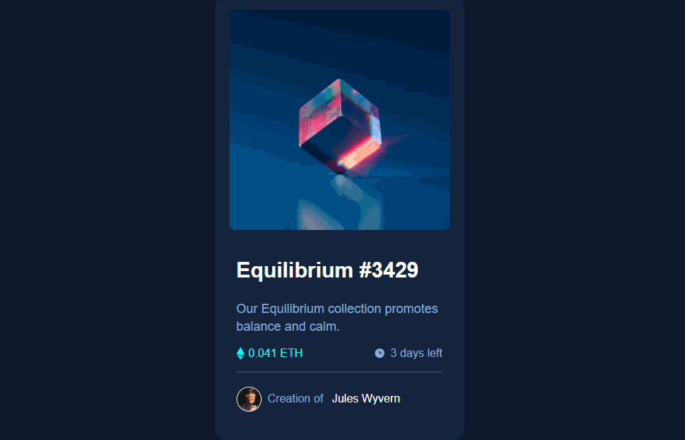
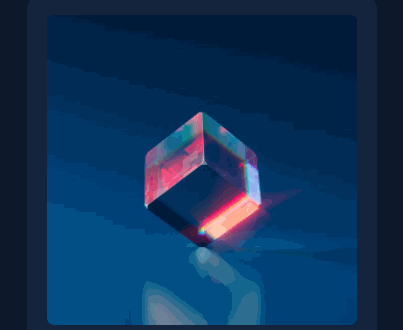

## # Frontend Mentor - solução de componente de cartão de visualização NFT ⌨
<a href="https://luvalentinaa.github.io/Card-NFT/">Acesse no Github Pages 🔗</a>

   
[
  
]


Esta é uma solução para o [desafio do componente de cartão de visualização NFT no Frontend Mentor](https://www.frontendmentor.io/challenges/nft-preview-card-component-SbdUL_w0U). Os desafios do Frontend Mentor ajudam você a melhorar suas habilidades de codificação criando projetos realistas.
🚀


- # Visão geral
  - [O desafio]Componente de  Cartão NFT 🎯
  - [Links] https://www.frontendmentor.io/challenges/nft-preview-card-component-SbdUL_w0U
- [Meu processo](#meu-processo)
  - # Construído com
- Marcação HTML5 semântica
- Propriedades personalizadas de CSS
- Flexbox
- Grade CSS
- Fluxo de trabalho mobile-first

- [Componentes estilizados](https://styled-components.com/) - Para estilos
    - # Agradecimentos - (#agradecimentos) Frontend Menthor https://www.frontendmentor.io/

  - ## O que mais Gostei
   []

   - ### Código desse efeito de hover sobre a imagem
```html
 <div class="nft-image">
          <a href="#" class="image-link">
            
          </a>
        </div>
```
``` css
.nft-image .image{
   width: 100%;
   display: block;
   margin: auto;
   border-radius: 7px;
}
.nft-image .image-link{
  position: relative;
  display: flex;
}
:hover.nft-image .image-link:before{
 content:'';
 background-color: var(--primary-medium);
 display: flex;
 align-items: center;
 justify-content:center;
 width: 100%;
 height: 100%;
 position: absolute;
 opacity: .5;
 border-radius:7px;
 transition: 0.5s ease-in-out;
}
:hover.nft-image .image-link::after{
  content:'';
  background-image: url(../images/icon-view.svg);
  background-repeat: no-repeat;
  background-position: center;
  display: flex;
  align-items: center;
  justify-content:center;
  width: 100%;
  height: 100%;
  position: absolute;
 }
```
